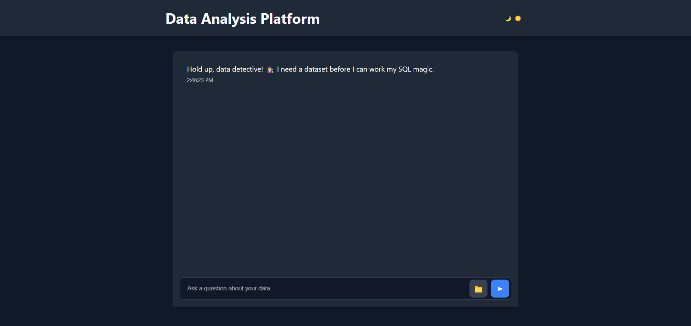
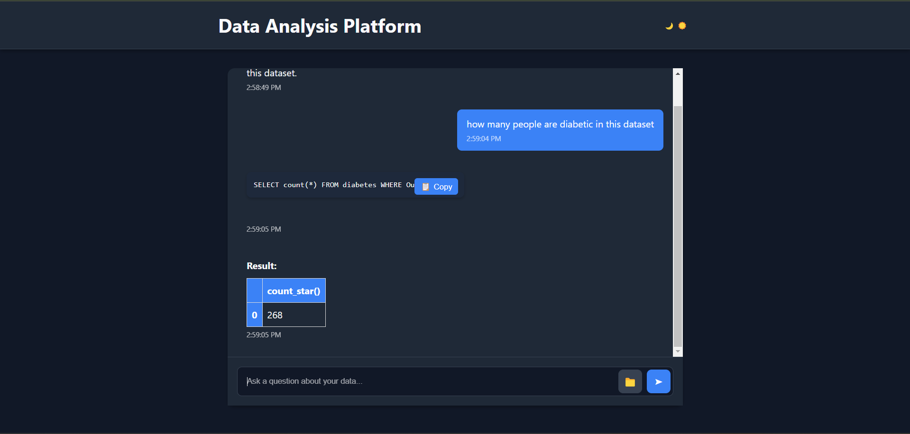
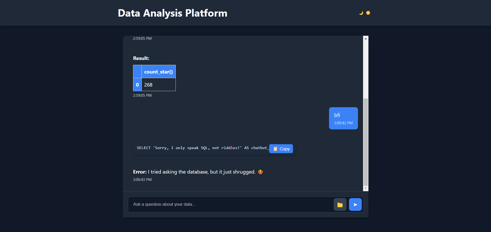

# NL2SQL: Natural Language to SQL Query Generator

## Overview
NL2SQL is a web-based application that allows users to upload a dataset and query it using natural language. The system processes the query, automatically generates the corresponding SQL code, executes it, and returns the results in a user-friendly format.

## Features
- **Upload Any Dataset**: Users can upload datasets in CSV format.
- **Natural Language Querying**: Enter queries in plain English, and the system will generate SQL.
- **SQL Execution**: The system runs the generated SQL query and displays the results.
- **Interactive Dashboard**: View results and data insights in an intuitive format.
- **Cloud Storage**: Uses MongoDB Atlas for dataset storage.
- **AI-Powered Query Generation**: Utilizes Gemini and LangChain for accurate SQL code generation.

## Tech Stack
- **Frontend**: HTML, CSS, JavaScript
- **Backend**: Python (Flask)
- **Database**: MongoDB Atlas
- **AI/ML**: LangChain, Gemini
- **SQL Engine**: MotherDuck DB

## Installation
### Prerequisites
- Python 3.8+
- MongoDB Atlas account
- MotherDuck DB setup
- API keys for Gemini and LangChain

### Steps
1. Clone the repository:
   ```bash
   git clone https://github.com/UnbeatableBann/NL2SQL.git
   cd NL2SQL
   ```
2. Create a virtual environment and activate it:
   ```bash
   python -m venv venv
   source venv/bin/activate  # On Windows use `venv\Scripts\activate`
   ```
3. Install dependencies:
   ```bash
   pip install -r requirements.txt
   ```
4. Set up environment variables in `.env` file:
   ```env
   MONGO_URI=your_mongodb_uri
   GEMINI_API_KEY=your_gemini_api_key
   LANGCHAIN_API_KEY=your_langchain_api_key
   ```
5. Run the application:
   ```bash
   python app.py
   ```
6. Open `http://127.0.0.1:5000/` in your browser.

## Usage
1. Upload a CSV file.
2. Enter a natural language query (e.g., "Show me the total sales in 2023").
3. View the generated SQL and the query results.

## Screenshots
Here are some screenshots of the project:
1. Dashboard


2. Using Natural Language query to convert into SQL Query


3. Handle Fallback Response


## Contributing
Contributions are welcome! Feel free to open an issue or submit a pull request.

## License
This project is licensed under the MIT License.

## Contact
For queries, reach out at [shadabjamadar4@gmail.com].

